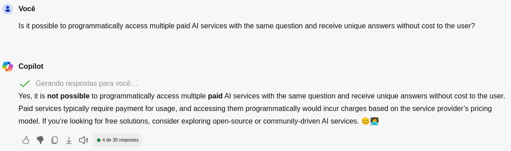

# Expert-AI

Is it possible to programmatically access multiple paid AI services with the same question and receive unique answers without cost to the user?



Sorry, now it is!


## Description

Expert-AI is an AI response's compiler. A program that accesses different artificial intelligences, collects the responses they provide to the same question, and then synthesizes a final response based on the obtained information.

## Features

1. Connect to multiple available artificial intelligence (AI) systems;
1. Send a question to the accessed AIs;
1. Collect the individual responses from each AI;
1. Analyze and synthesize a consolidated final response.


## Install

Install Go from https://go.dev/ or using gvm https://github.com/moovweb/gvm .

```
git clone git@github.com:evandrojr/expert-ai.git
go mod tidy
echo "Who invented the airplane" > prompt.txt
```

## Run
Close Chrome before and run it with chromedp enabled.

```
killall chrome
google-chrome --remote-debugging-port=9222
go run .
```

## Getting in touch

 [Evandro Jr +5571982864766 ![WhatsApp][whatsapp-logo]](https://wa.me/5571982864766)

[whatsapp-logo]: https://upload.wikimedia.org/wikipedia/commons/thumb/6/6b/WhatsApp.svg/32px-WhatsApp.svg.png

## Project Naming Convention

In Go, there is no rigid file naming standard, but there are some commonly adopted conventions:

Naming packages: Package names should be written in lowercase and preferably in the singular. For example: main, utils, user_service.

Naming variables and functions: The Go naming convention follows the "camelCase" style for functions and variables. For example: calculateTotal(), getUserById(), maxValue.

Naming constants: Constants are generally written in uppercase, with words separated by underscores. For example: MAX_USERS, DEFAULT_TIMEOUT.

Naming types: Custom types, such as structs and interfaces, are usually written with the first letter capitalized. For example: User, UserService, HttpHandler.

Grouping related files: When you have multiple files related to the same package, it's common to group them in the same directory. For example: user/user.go, user/user_test.go, user/user_repository.go.

These are the main Go file naming conventions, but the important thing is to be consistent throughout your project. Clarity and readability of the code are the primary objectives.